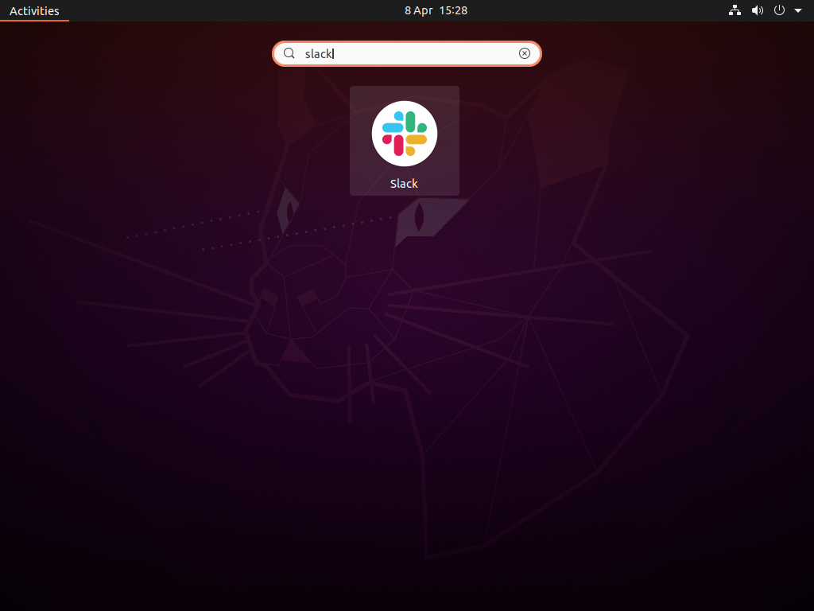
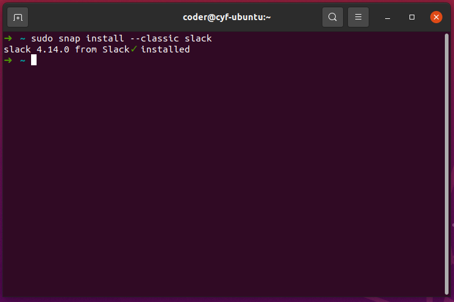
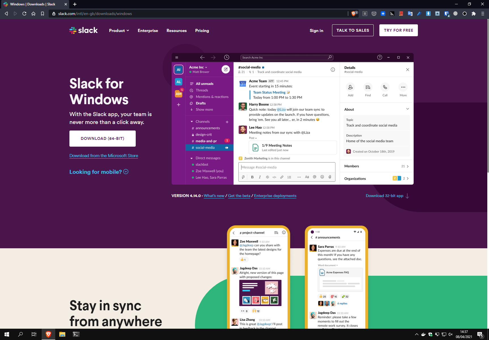
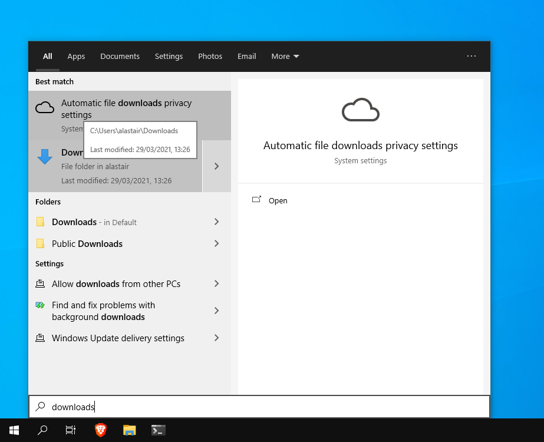
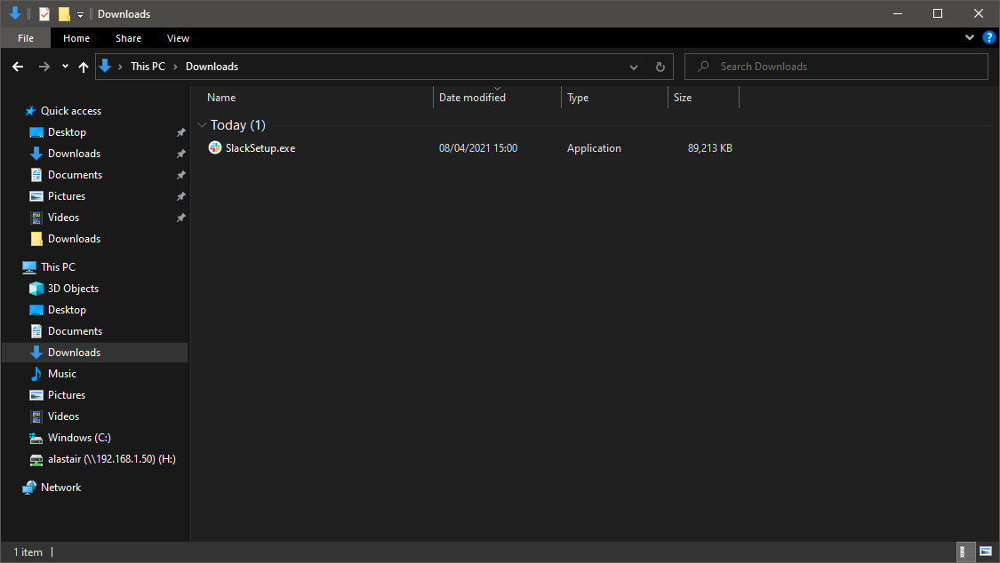

# Software Installation

### Ubuntu Linux

First check that you don't have Slack installed already - if your laptop was supplied by CodeYourFuture it probably is. To do this press the Windows key on your keyboard which brings up the Activities Overview, then type 'slack'. If you have Slack installed then an icon for it will appear which you can click on to launch the program.

If you do not already have Slack installed then you will need to download and install it. To do this, the quickest way is to open the Terminal \(this is a more advanced tool that you don't need to think about now but will see more of in the Full Stack course\).

To do this press 'Ctrl+Alt+T' at the same time on your keyboard and you should get a Terminal window like the one below.

Once you have done this you will need to type the following command, which is a special instruction that tells Ubuntu to download and install Slack for you:

`sudo snap install --classic slack`

You will be asked for a password. This is the same password which you use to log in to your laptop. Once you have done this and the Terminal looks like the picture above then you can close it by clicking the orange close button and then press the Windows key and try running Slack as before.
### macOS

The simplest way to install Slack on a Mac is from the App Store. To do so click on the blue App Store icon on the Dock at the bottom of your screen and you should be able to search from and install Slack here.

If you think you might have Slack installed already you can check by searching for it in Spotlight \(press Cmd-Space on your keyboard and then type 'slack' and see if it comes up\).

### Windows 10

On Windows 10 the best way to install Slack is to download it directly from the web site at the following address:

[https://slack.com/intl/en-gb/downloads/windows](https://slack.com/intl/en-gb/downloads/windows)

Clicking on the white 'Download' button will automatically download the right version for your computer.

Click Downloads and then Save in the 'Save as' box that appears.

Once Slack has downloaded you will need to install it.

To do this open the Start menu, type Downloads and then click the Downloads option in the list to go to the Downloads folder.

Once there double-click on the 'slack-setup' file. This will take a minute or two run and then once complete Slack will start.

### Android and iPhone

For your phone you can find Slack in the Play Store on Android or in the App Store on iPhone.

